# Palm

**A botanical identity developed through sketches, growth studies and procedural variation — Maison d’Atelier.**

## Coverage, Exposed Substrate and Silhouette

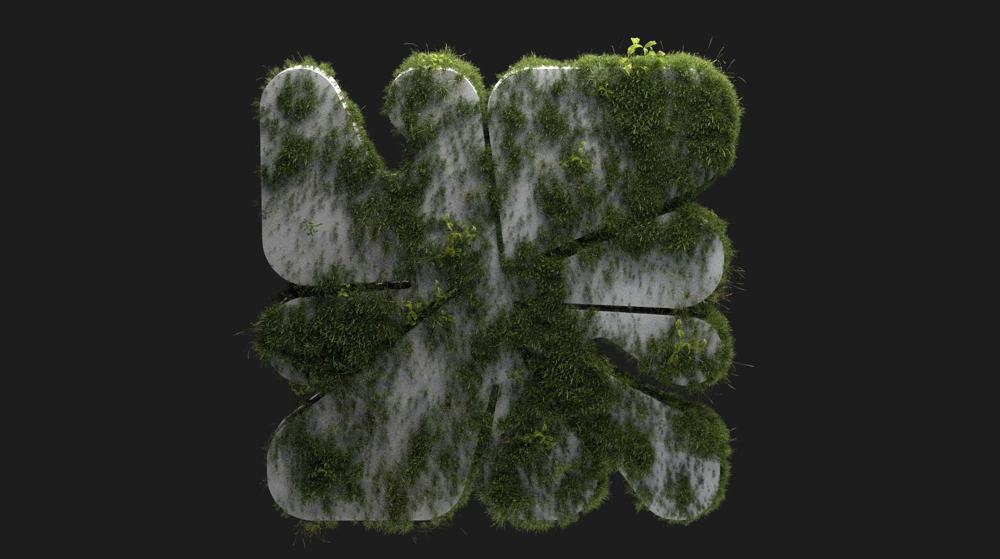
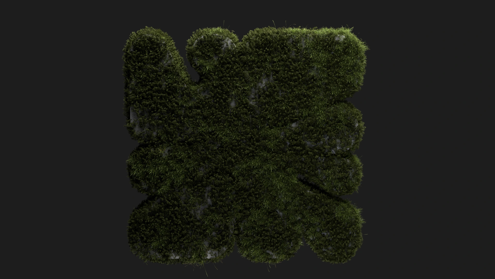
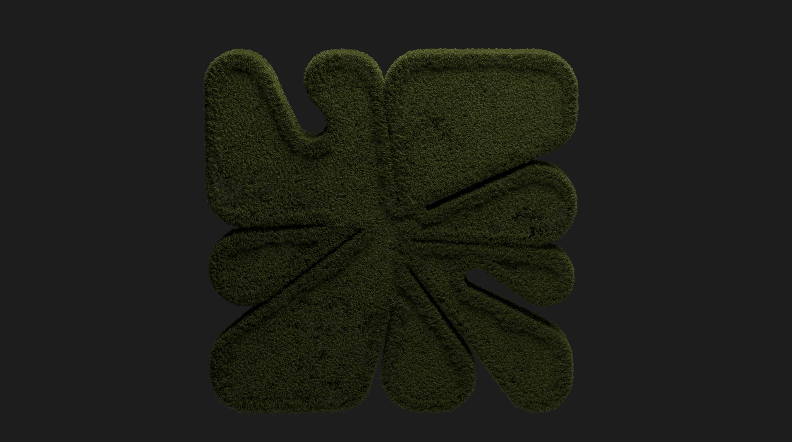

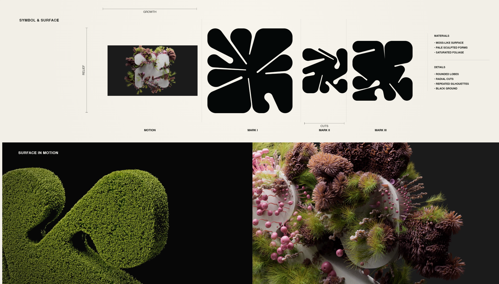

The grass variants change the balance between exposed pale surface and dark green coverage. In the dense version, the center and channels become harder to separate. The flatter outline study tests the opposite priority: broad, readable lobes with less competition from tall growth.

These are distinct visual tests. The images do not establish an exact generation order or a controlled one-parameter experiment.

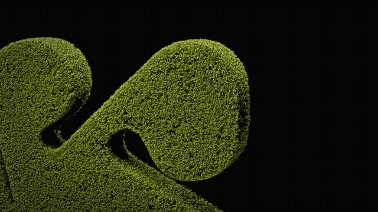

[Grass-only movie](media/video/grass-only.mp4) · [all five coverage studies](docs/media-index.md#images)

## Sketching the Growth

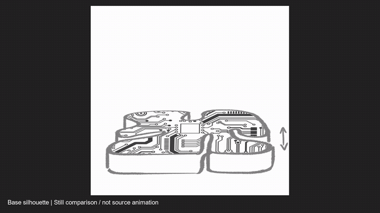

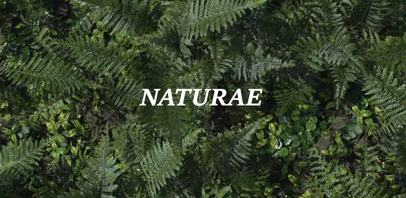

NATURAE: layered fern fronds and glossy foliage as a reference for coverage and readable growth.

Likely source: [Naturae](https://vimeo.com/493513393) by Ian Frederick (design and animation), with Flank Audio (music and sound design). Credits verified on the original film page; the exact screenshot has not been frame-matched. External CG inspiration. [Provenance](docs/references.md).

[All five sketches as a still comparison](media/video/growth-sketch-review.mp4)

The comparison holds each drawing for two seconds and is explicitly labeled as assembled stills. It preserves the drawings’ relationship without presenting them as an original playblast.

## Procedural Color Variation in Houdini

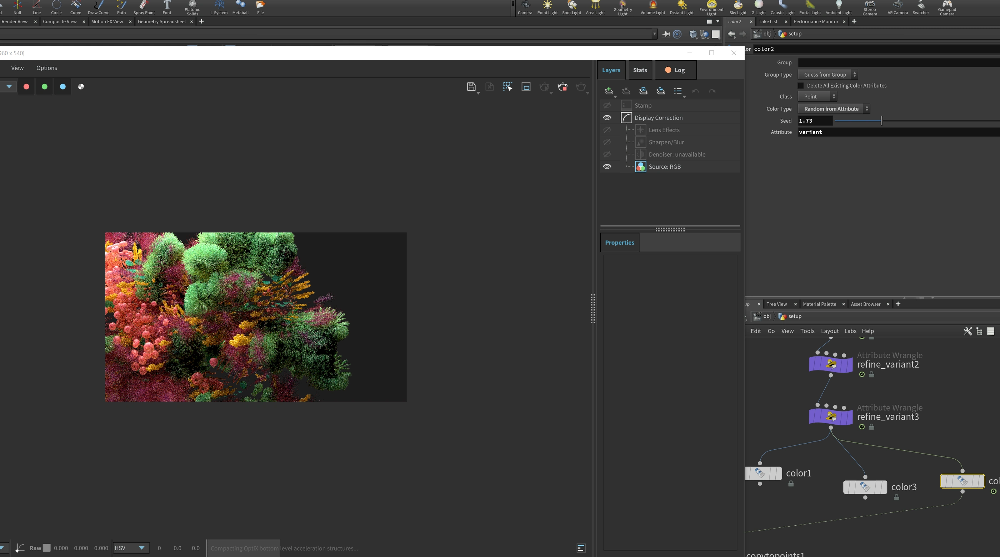

The screenshot shows `refine_variant` attribute-wrangle nodes feeding Color branches. The selected Color node is set to **Random from Attribute**, using `variant` on points. That is direct evidence of attribute-driven color variation; it does not expose the full scattering or animation setup.

The render preview puts neighboring clusters into contrasting colors. This is useful for judging whether individual growth groups remain distinguishable when the surface becomes crowded.

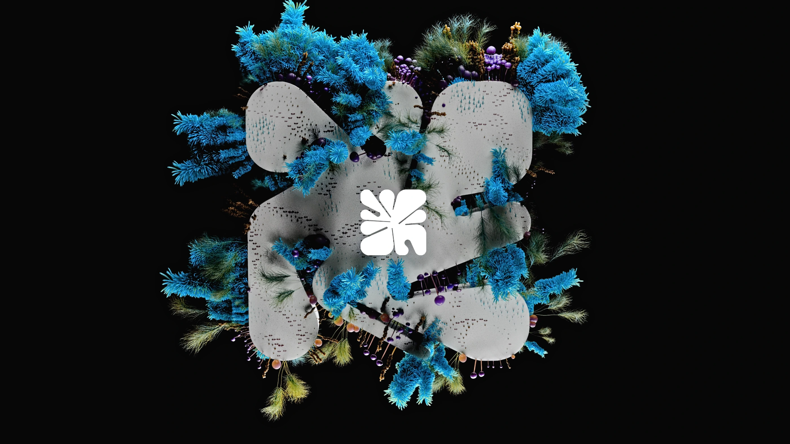
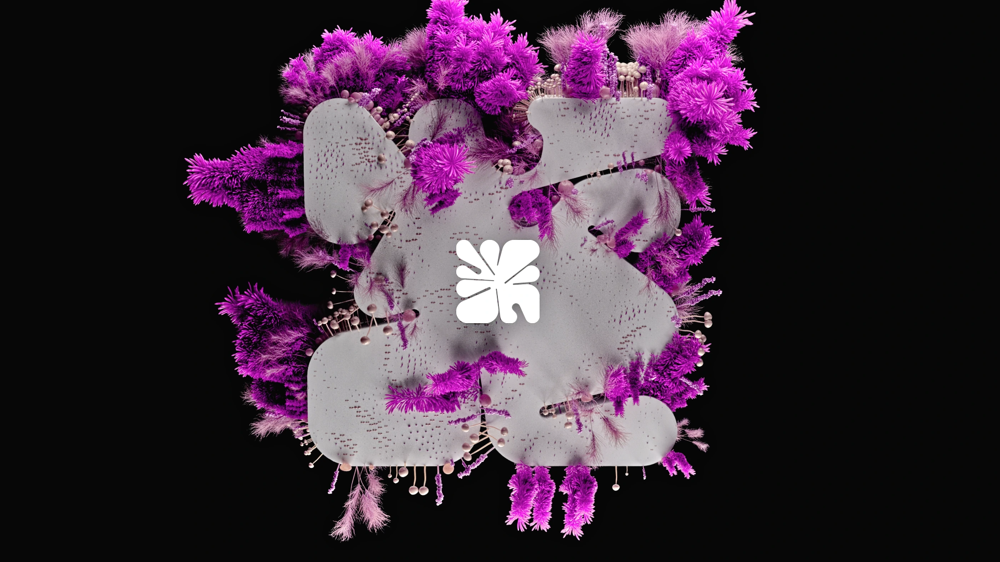

---

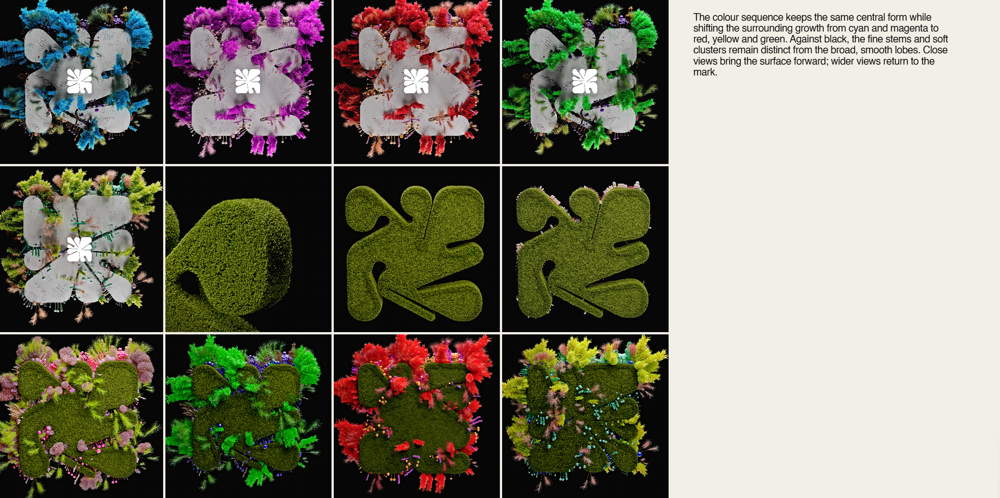

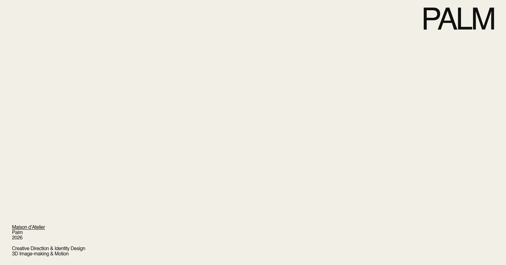

