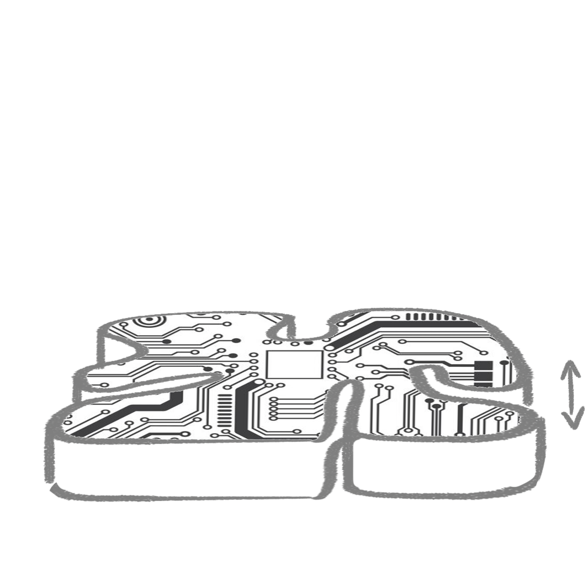
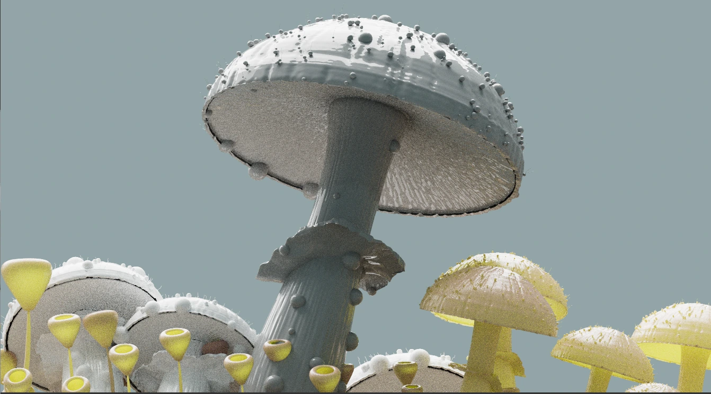
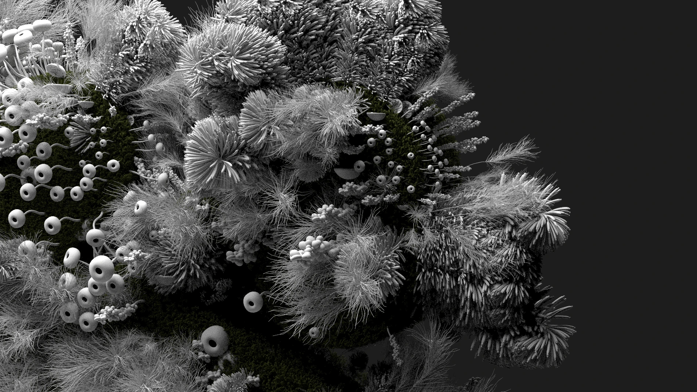
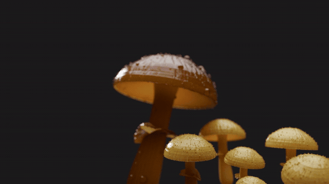
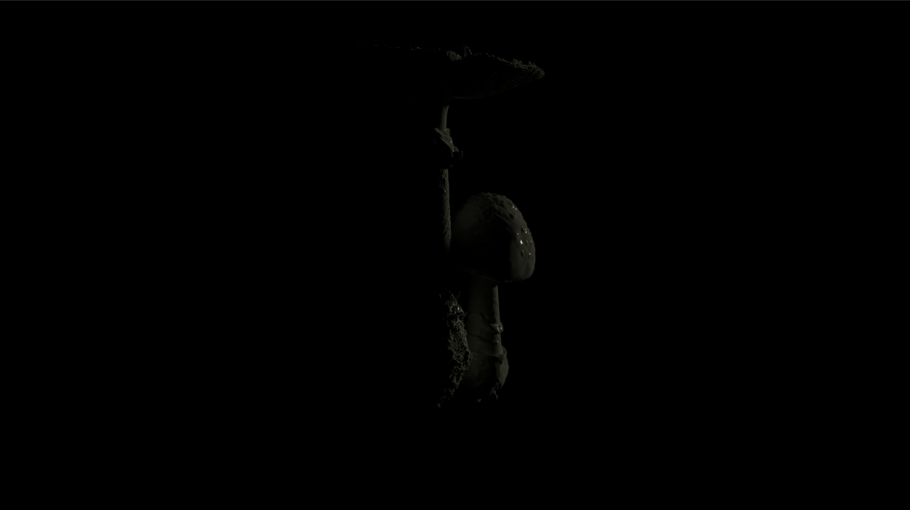
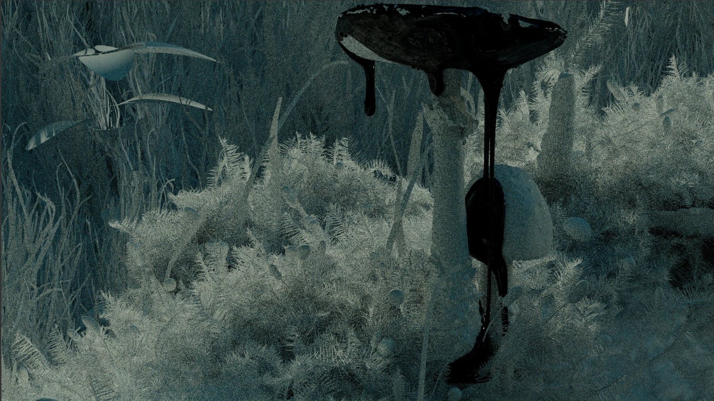
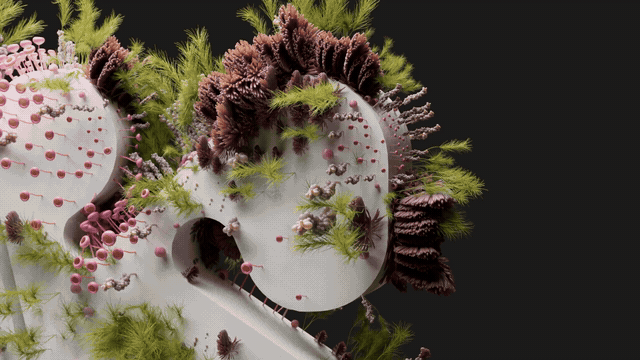
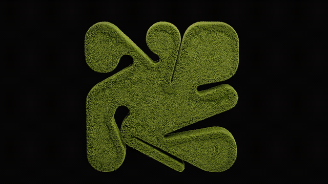
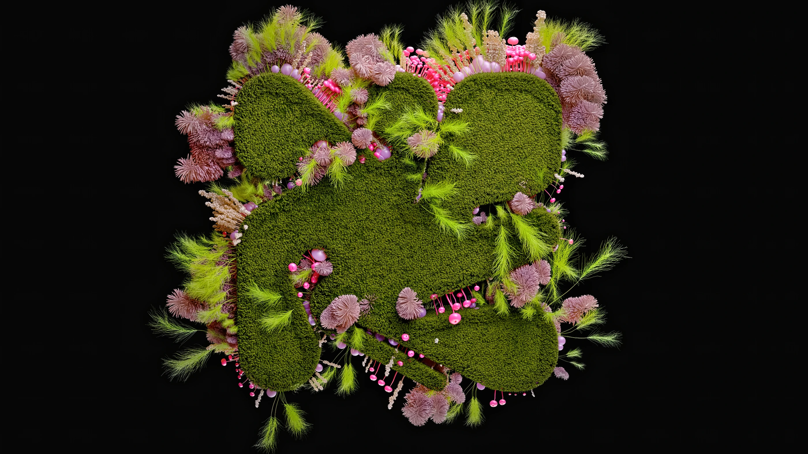

# Palm

**A botanical identity developed through sketches, growth studies and procedural variation — Maison d’Atelier.**

The starting point is a compact mark with rounded lobes and deep radial cuts. The development problem is to give it a living surface without losing that silhouette. The source material moves between a pale substrate, dense grass and clusters of mushrooms and fine growth; material, density and color each change how clearly the mark reads.

This archive includes the newly supplied process images, Houdini work, intermediate lighting tests, numbered render batches and final motion. It distinguishes concept drawings from captured animation and keeps the visible experiments alongside the finished images.

## 01 / Sketching the growth

Five drawings describe a progression: the shallow mark, growth along its channels, a taller central sprout, then mushrooms emerging and opening. The arrows communicate proposed motion. They are design intent, not evidence that a particular simulation or rig was used.

[All five sketches as a still comparison](media/video/growth-sketch-review.mp4)

The comparison holds each drawing for two seconds and is explicitly labeled as assembled stills. It preserves the drawings’ relationship without presenting them as an original playblast.

## 02 / Developing the growth vocabulary

The mushroom study exposes cap, stem and underside shapes. The uncolored close-up brings together hollow tubes, fine blades and clustered forms. Removing strong color makes the competing shapes and their density easier to inspect.

The `HRez_cam21` render was stored in two contiguous folders: frames 1–48 and 49–100. They are joined in numerical order into one 100-frame review. The PNG frames were used once; the parallel JPG copies were not converted again.

[Full mushroom camera review](media/video/mushroom-cam21.mp4)

## 03 / Coverage, exposed substrate and silhouette

The grass variants change the balance between exposed pale surface and dark green coverage. In the dense version, the center and channels become harder to separate. The flatter outline study tests the opposite priority: broad, readable lobes with less competition from tall growth.

These are distinct visual tests. The images do not establish an exact generation order or a controlled one-parameter experiment.

[Grass-only movie](media/video/grass-only.mp4) · [all five coverage studies](docs/media-index.md#images)

## 04 / Procedural color variation in Houdini

The screenshot shows `refine_variant` attribute-wrangle nodes feeding Color branches. The selected Color node is set to **Random from Attribute**, using `variant` on points. That is direct evidence of attribute-driven color variation; it does not expose the full scattering or animation setup.

The render preview puts neighboring clusters into contrasting colors. This is useful for judging whether individual growth groups remain distinguishable when the surface becomes crowded.

## 05 / Lighting tests that conceal and reveal

One test leaves most of the subject almost invisible; the cool study reveals stems and surrounding fine growth but remains low in contrast. Keeping these intermediate states makes the lighting problem visible: atmosphere alone does not guarantee a readable mark or a clear hierarchy of forms.

The files do not label these as failed renders. They are retained as visible limits and alternatives, without inventing the author’s reasons for rejecting or revising them.

## 06 / Camera development and finished motion

The existing close-up movie covers camera-7 frames 50–102. A further 20-frame batch, 103–122, continues the same view. The existing opening movie is reused and only that uncovered tail is newly encoded.

[Close-up opening](media/video/original-closeup.mp4) · [newly recovered continuation](media/video/closeup-cam7-continuation.mp4) · [wide slow view](media/video/original-slow.mp4)

The 22-frame camera-8 render already has a corresponding movie and a slow delivery version; the slow movie is reused. The larger numbered portfolio export shares the finished compositions with the existing edited film, so a second portfolio video was not generated from those frames.

The finished sequence lets the same identity move between grass, pale material and saturated growth. Wider views recover the mark; close views reward inspection of the surface.

[Watch the complete selected portfolio film](media/video/portfolio-film.mp4)

## Archive notes

- [All media](docs/media-index.md) · [source and processing manifest](docs/media-manifest.json) · [audit decisions](docs/audit-notes.md)
- New sequence reviews use 24 fps, consistent with the existing Palm movies. GIFs are short previews; MP4s preserve the full selected clips.
- A damaged numbered PNG and unrelated reference screenshots were excluded. Source masters, including the large portfolio movie, remain untouched.
- The case study is organized around visible development questions. It does not infer a complete production chronology, solver settings or a growth algorithm from renders alone.
