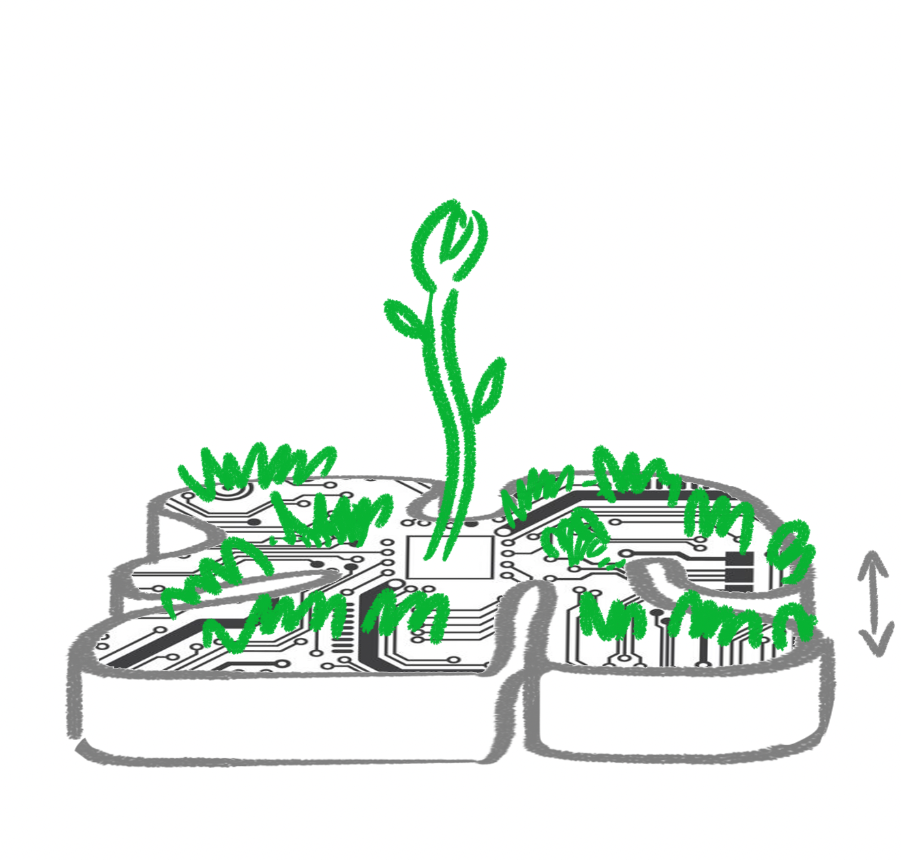
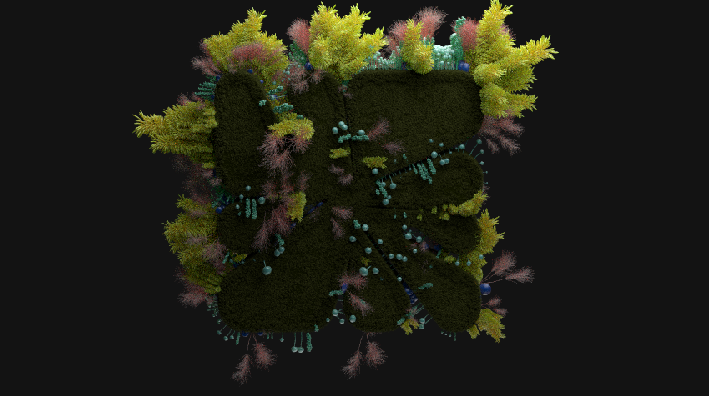

# Palm

**A botanical identity developed through sketches, growth studies and procedural variation — Maison d’Atelier.**

## Coverage, Exposed Substrate and Silhouette

The grass variants change the balance between exposed pale surface and dark green coverage. In the dense version, the center and channels become harder to separate. The flatter outline study tests the opposite priority: broad, readable lobes with less competition from tall growth.

These are distinct visual tests. The images do not establish an exact generation order or a controlled one-parameter experiment.

[Grass-only movie](media/video/grass-only.mp4) · [all five coverage studies](docs/media-index.md#images)

## Sketching the Growth

*NATURAE reference: overlapping fern fronds and glossy leaves create a dense surface while differences in leaf scale keep the growth readable. This supports Palm’s exploration of coverage, fine detail and the visibility of the underlying mark. Source file: `Screenshot 2022-03-20 150624.jpg`.*

The likely source is **[Naturae](https://www.behance.net/gallery/109979317/Naturae)**, credited to **Ian Frederick** for design and animation and **Flank Audio** for music and sound design; the [original film](https://vimeo.com/493513393) describes experiments in nature and organic growth. The project credit is verified, but this exact screenshot’s frame match is not independently confirmed. It is retained as external motion-design inspiration, not a Palm render or verified nature photograph. [Source details](docs/references.md).

Five drawings describe a progression: the shallow mark, growth along its channels, a taller central sprout, then mushrooms emerging and opening. The arrows communicate proposed motion. They are design intent, not evidence that a particular simulation or rig was used.

[All five sketches as a still comparison](media/video/growth-sketch-review.mp4)

The comparison holds each drawing for two seconds and is explicitly labeled as assembled stills. It preserves the drawings’ relationship without presenting them as an original playblast.

## Procedural Color Variation in Houdini

The screenshot shows `refine_variant` attribute-wrangle nodes feeding Color branches. The selected Color node is set to **Random from Attribute**, using `variant` on points. That is direct evidence of attribute-driven color variation; it does not expose the full scattering or animation setup.

The render preview puts neighboring clusters into contrasting colors. This is useful for judging whether individual growth groups remain distinguishable when the surface becomes crowded.

---

